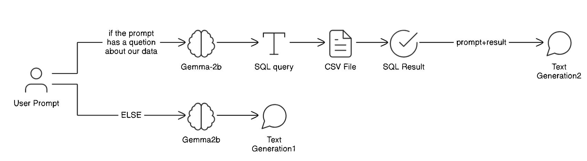

# MyTeamBot - Football Management Assistant ⚽

MyTeamBot is an intelligent assistant designed to answer questions related to players in the Moroccan Botola football league. It uses advanced language models to generate SQL queries from natural language questions and interact with player data stored in a CSV file.

## Project Schema



## Features

- **SQL Querying**: Ask questions about players, and MyTeamBot generates SQL queries to retrieve relevant information from the player data.
- **User-Friendly Interface**: A simple, interactive interface built with Streamlit to make communication with the chatbot easy.
- **Conversational Responses**: If a question falls outside the scope of player statistics, MyTeamBot responds in a polite and friendly manner.

## Requirements

- Python 3.8+
- [Streamlit](https://streamlit.io)
- [Transformers](https://huggingface.co/transformers/)
- GPU recommended for large models

## Installation

Clone the GitHub repository or download the project files, then install the dependencies using the `requirements.txt` file.

### Steps to install dependencies:

1. Clone this repository:
    ```bash
    git clone https://github.com/jawadoch/nlp_to_sql_chatbot.git
    ```

2. Navigate into the project directory:
    ```bash
    cd myteambot
    ```

3. Create a virtual environment (recommended):
    ```bash
    python -m venv env
    source env/bin/activate  # On Windows: env\Scripts\activate
    ```

4. Install the necessary dependencies:
    ```bash
    pip install -r requirements.txt
    ```

### Running the Application

1. Start the chatbot using Streamlit:
    ```bash
    streamlit run app.py
    ```

2. Once the application starts, it should be accessible via your web browser at the following URL:
    ```
    http://localhost:8501
    ```


## Usage

Once the application is running, you can ask MyTeamBot natural language questions, such as:

- **"List all the players in the Botola."**
- **"Who scored more than 10 goals this season?"**
- **"Which players received red cards?"**

MyTeamBot will automatically generate SQL queries based on your question and retrieve the relevant information from the CSV file.

## Customization

- You can modify the pre-trained model or adjust the conversational responses by editing the functions in `app.py`.
- The CSV file containing player data can be updated with new statistics as needed.
